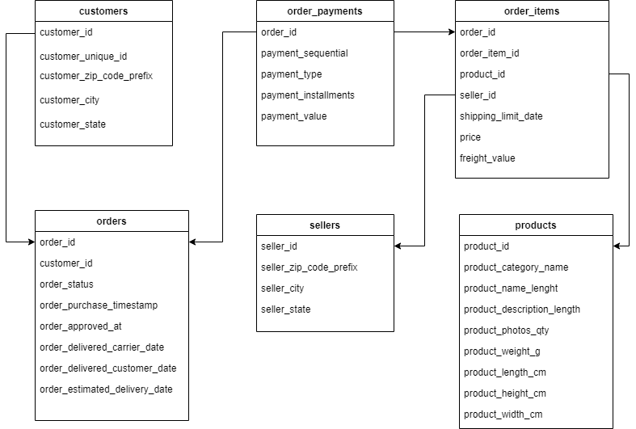
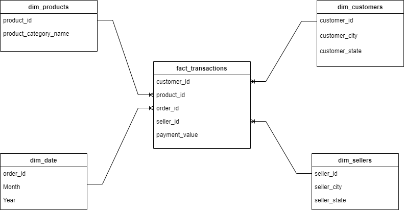
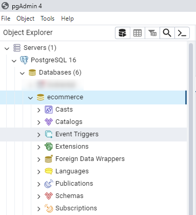
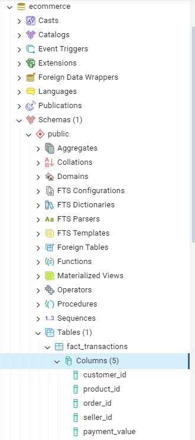
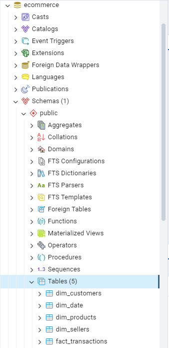

# Modeling E-Commerce data using Python and Postgres and Visualizing insights using Power BI

This project shows how to build a data model using Python and stored it in a PostgreSQL database, as our Data Warehouse.

Then, we answer to some business questions using visualizations from Power BI.

## 1. The Data

Data are downloaded from [Kaggle](https://www.kaggle.com/datasets/olistbr/brazilian-ecommerce/).

## 2. Reading the data

We use the pandas library to read the data.

```python
customers = pd.read_csv("dataset/customers.csv")
order_items = pd.read_csv("dataset/order_items.csv")
order_payments = pd.read_csv("dataset/order_payments.csv")
orders = pd.read_csv("dataset/orders.csv")
products = pd.read_csv("dataset/products.csv")
sellers = pd.read_csv("dataset/sellers.csv")
```

## 3. Presenting the schema of our tables

Here is the schema of our tables, and the relationship between our tables :



## 4. Defining the use case of the data

To know what data to put into the tables of our data model, we need to know what the data is going to be used for. This part is usually done by having a conversation with the users of the Data Warehouse. Then we can create a data model for the required data.

We create a data model that supports the following analysis:

* What places contributed the most/least to product sales?
* Which seller sold the most/least products?
* Best and worst performing products.
* Date for all orders.

## 5. Creating a star schema

Here is our data model with tables to be loaded in our Data Warehouse:



## 6. Creating the data model tables from the existing tables

### 6.1 Creating the fact_transactions table

To create the **fact_transactions** table, we joined **orders**, **order_payments** and **order_items** tables to produce a unique table.

### 6.2 Creating the dim_customers table

We extract from the **customers** table the needed columns: *customer_id*, *customer_city*, *customer_state*.

### 6.3 Creating the dim_products table

We extract from the **products** table the needed columns: *product_id* and *product_category_name*.

### 6.4 Creating the dim_sellers table

We extract from the **sellers** table the needed columns: *seller_id*, *seller_city*, *seller_state*.

### 6.5 Creating the dim_date table

First, we extract the *order_id* and the *order_purchase_timestamp* columns from the **orders** table.

Second, We convert *order_purchase_timestamp* column into the datetime format.

Last, We extract the month and year from the *order_purchase_timestamp* datetime column.

## 7. Creating a PostgreSQL Database and connecting to it

To connect to our PostgreSQL database from Python, we use the psycopg2 library. Here is our database in the PostgreSQL server using pgAdmin interface:



## 8. Creating our model tables in the database

We write SQL queries to create our table and execute it. Here is the **fact_transactions** table in the PostgreSQL database:



## 9. Inserting data into database tables

We write SQL queries to insert rows into the tables. We read each row from the dataframe and insert it into the corresponding table in the ***ecommerce*** database. We can see our tables loaded in the PostgreSQL database:


